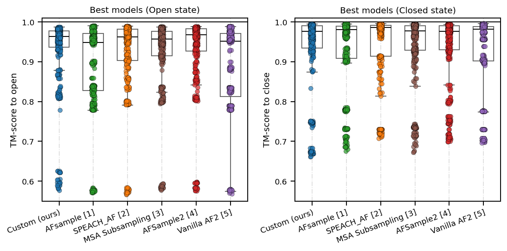
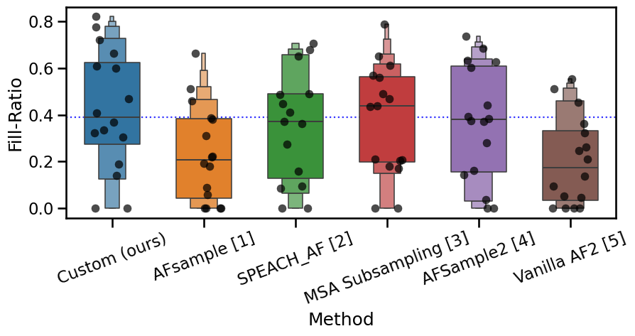
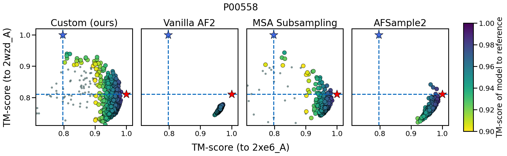

#+TITLE: Ablating AlphaFold2 Inputs

* Motivation

AlphaFold2 (AF2) relies heavily on the multiple sequence alignment (MSA) resulting from the input amino acid sequence for co-evolutionary signal,
which biases it toward a single consensus conformation per sequence. Many important proteins (membrane transporters, GPCRs) are conformationally
heterogeneous (e.g. inward-/outward-facing, inactive/active), and capturing this heterogeneity matters for mechanistic understanding and protein design.
Prior work has shown AF2 can be coerced into sampling alternative conformations by perturbing its MSA or query sequence input [2, 3, 4], but these ablations have only been studied in isolation.

* Description

This project systematically benchmarks the methods in combination on the OC23 dataset, quantifying how each ablation method shifts the predicted conformational ensemble.
Additionally, a novel ablation method was developed, based on clustering the MSA into subfamilies based on per-row ProtT5 embeddings [5]. This is followed by per MSA cluster
residue contact prediction using MSA Transformer [6], from which the row-wise attention matrix can be used to determine the residues that cause the highest fold change.
This method was shown to outperform state of the art ablation methods on certain target proteins.

* Ablation methods

- *MSA subsampling (depth)* :: subsample the MSA to various depths (16-5120 sequences) [2].
- *MSA column masking* :: randomly mask a fraction (5-50%) of MSA columns
  (excluding the query row) with the unknown token ~X~ or alanine, diluting
  co-evolutionary signal [3].
- *Query sequence masking* :: mask/replace a fraction (5-100%) of query
  sequence positions (e.g. with alanine), with or without full MSA present.
- *Combined ablations* :: query masking + MSA depth subsampling, and query
  masking + MSA column masking

Compared against AFsample and AFsample2 [4] as additional baselines, on top
of vanilla AlphaFold2 [1].

* Metrics
- *TM-score*, computed with TM-align [7]
- *Per-residue RMSF*
- *Fill-ratio* [4]

* Results

Best-model TM-scores to the open and closed reference states across the
OC23 benchmark, comparing our custom ablation method against AFsample,
SPEACH_AF, MSA subsampling, AFsample2, and vanilla AF2:

#+CAPTION: Best-model TM-scores per method

Fill-ratio (ensemble coverage between the two reference states) per method:

#+CAPTION: Fill-ratio per method

#+CAPTION: The protein target where the custom method performed best according to the Fill-Ratio metric (P00558)

* References

Full BibTeX entries are in [[./PP1.bib]].

1. Jumper, John, et al. "Highly accurate protein structure prediction with AlphaFold." /Nature/ 596.7873 (2021): 583-589.
2. Del Alamo, Diego, et al. "Sampling alternative conformational states of transporters and receptors with AlphaFold2." /eLife/ 11 (2022): e75751.
3. Stein, Richard A., and Hassane S. Mchaourab. "SPEACH_AF: Sampling protein ensembles and conformational heterogeneity with Alphafold2." /PLOS Computational Biology/ 18.8 (2022): e1010483.
4. Kalakoti, Yogesh, and Björn Wallner. "AFsample2 predicts multiple conformations and ensembles with AlphaFold2." /Communications Biology/ 8.1 (2025): 373.
5. Elnaggar, Ahmed, et al. "ProtTrans: Towards cracking the language of life's code through self-supervised deep learning and high performance computing." /arXiv:2007.06225/ (2021).
6. Rao, Roshan M., et al. "MSA Transformer." /Proceedings of the 38th International Conference on Machine Learning/ (2021): 8844-8856.
7. Zhang, Yang, and Jeffrey Skolnick. "TM-align: a protein structure alignment algorithm based on the TM-score." /Nucleic Acids Research/ 33.7 (2005): 2302-2309.
